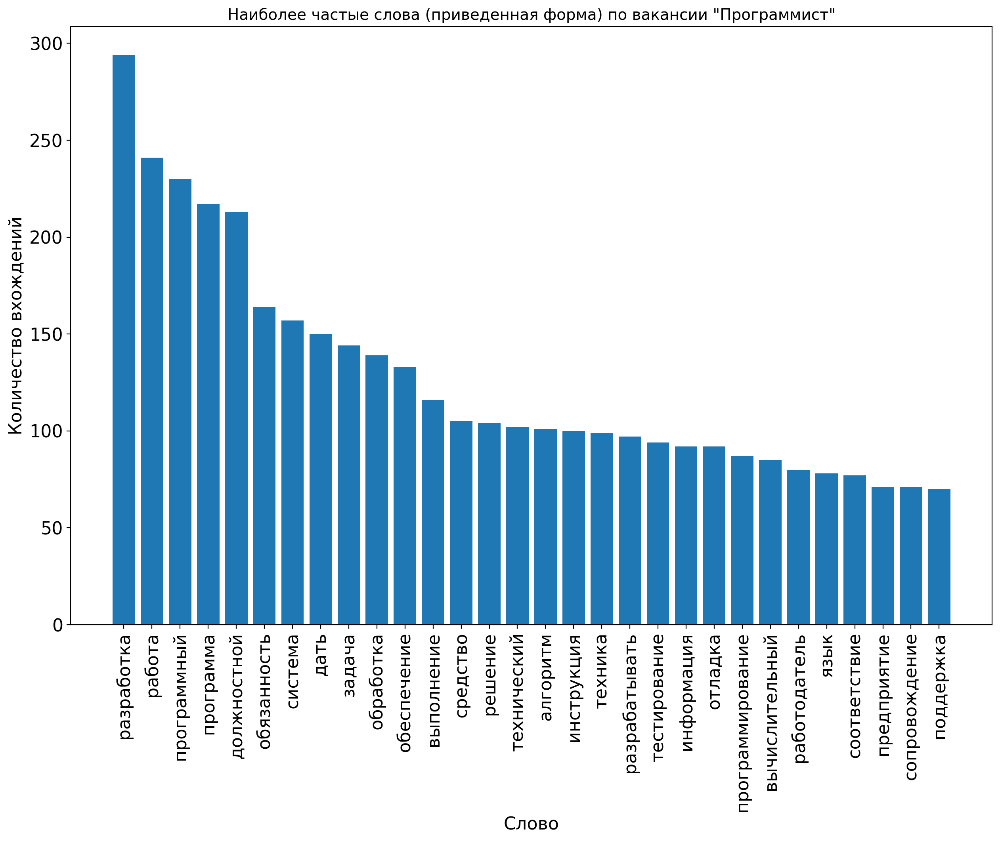
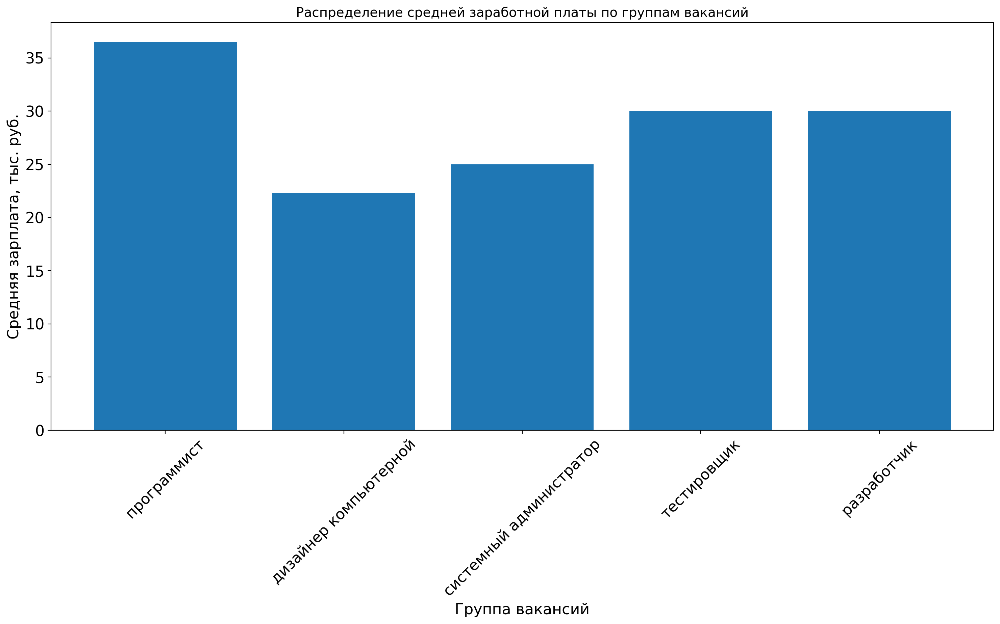
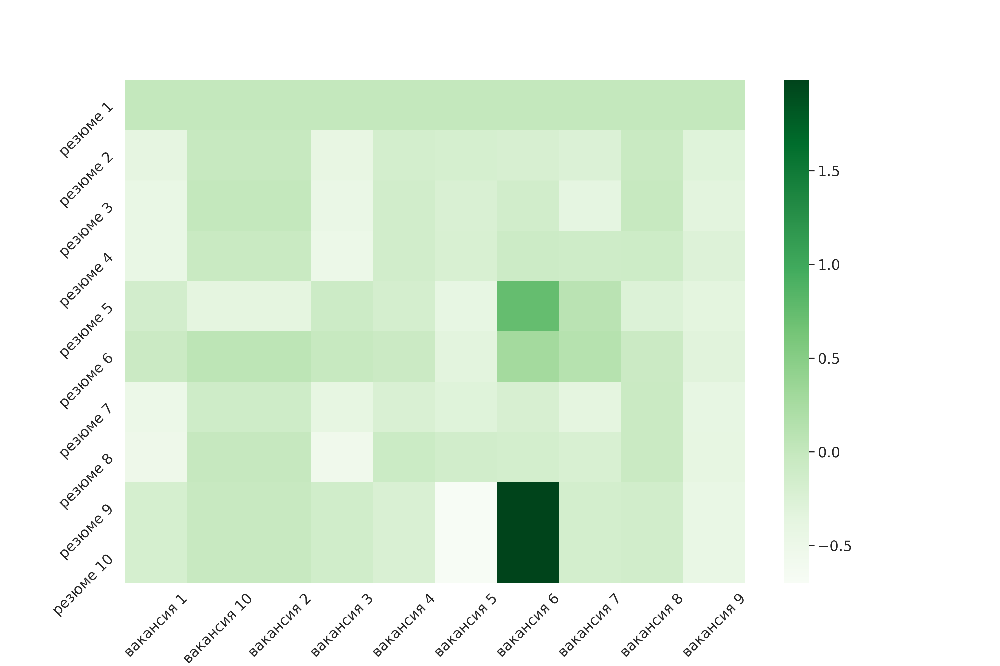

# “Цифровой Прорыв” 2020 Финал

## Команда Deaf Lizards

## Кейс Газпромбанк

[![github workflow stage build img]][github workflow stage build]
[![github workflow prod deploy img]][github workflow prod deploy]

[github workflow stage build img]: https://github.com/melchugin/choiceapp.deaflizards.ru/workflows/Docker%20image%20stage%20CI/badge.svg?branch=stage
[github workflow stage build]: https://github.com/melchugin/choiceapp.deaflizards.ru/actions?query=workflow%3A%22Docker+image+stage+CI%22

[github workflow prod deploy img]: https://github.com/melchugin/choiceapp.deaflizards.ru/workflows/Production%20deploy/badge.svg?branch=master
[github workflow prod deploy]: https://github.com/melchugin/choiceapp.deaflizards.ru/actions?query=workflow%3A%22Production+deploy%22

[ChoiceApp](https://choiceapp.deaflizards.ru) — сервис, который поможет кандидату и рекрутеру найти друг друга!

Requirenments
Docker, Docker-Compose

Installation

```sh
git clone it@github.com:melchugin/choiceapp.deaflizards.ru.git
cd choiceapp.deaflizards.ru
docker-compose build --compress --force-rm --parallel --pull
docker-compose up
```

## Containers info


# Research / Исследование

## Модель для определения эмоциональной окраски текста

Зависимости:
* `tensorflow >= 2` 
* `keras`
* `nltk`
* `navec`

Модель обучалась на базе русскоязычных твиттов. Датасет: https://study.mokoron.com/. В основе лежит LSTM-сеть и несколько полносвязных слоёв. Модель сохранена в формате `keras`\`а в файле `research/sentiment_predictor`. Обучалась на GPU, в файле `research/train_history.pickle` находится история обучения, в виде `dict`, ключи:
* `loss` - ошибка на обучающих данных (Categorical Crossentropy)
* `val_loss` - ошибка на валидационных данных (Categorical Crossentropy)
* `acc` - точность на обучении
* `val_acc` - точность на валидационных данных

Валидация составляла 10% от обучающей выбокри, валидационные данные выбирались случайно каждые 100 эпох.

Для самостоятельного обучения можно использовать как jupyter-тетрадку, так и `research/trainer.py`, однако, необходимо получить эмбединги для слов (ввиду ограниченности объема github файлы `.npy` не загружали), для этого выполнить:

```python
from nltk.tokenize import word_tokenize
from navec import Navec
import re

import numpy as np
import pandas as pd

path = <путь до файла navec_hudlit_v1_12B_500K_300d_100q.tar (в папке research)> 
navec = Navec.load(path)

positive = pd.read_csv("research/train_data/positive.csv", delimiter=";", index_col=False)
negative = pd.read_csv("research/train_data/negative.csv", delimiter=";", index_col=False)
positive['ttext'] = positive['ttext'].apply(lambda x: x.lower())
positive['ttext'] = positive['ttext'].apply((lambda x: re.sub('[^a-zA-z0-9\s]','',x)))
negative['ttext'] = negative['ttext'].apply(lambda x: x.lower())
negative['ttext'] = negative['ttext'].apply((lambda x: re.sub('[^a-zA-z0-9\s]','',x)))

X = np.hstack([positive["ttext"].values , negative["ttext"].values)
y = (np.hstack([positive["ttype"].values , negative["ttype"].values) + 1) / 2
y = np.eye(2)[y.reshape(-1).astype(np.int8)]

def vectorizator(X:np.array, max_lenth=None):
    tokens = []
    if max_lenth == None:
        max_lenth = 0
        flag_to_compute = True
    else:
        flag_to_compute = False
        
    for i in X:
        tokens.append(word_tokenize(''.join( c for c in re.sub(r'', '', i) if  c not in '.,!()-:?' )))
        if flag_to_compute == True and len(tokens[-1]) > max_lenth:
            max_lenth = len(tokens[-1])
    
    print(f"Максимальная длинна сообщения: {max_lenth}")
    
    for i in range(len(tokens)):
        tokens[i].extend([0 for x in range(max_lenth - len(tokens[i]))])
    
    vec = np.ndarray(shape=(len(X), max_lenth, 300))
    
    for phrase in range(len(tokens)):
        for word in range(len(tokens[phrase])):
            if tokens[phrase][word] == 0:
                vec[phrase, word] = np.zeros(shape = (1, 300))
            else:
                try :
                    vec[phrase, word] = navec[tokens[phrase][word].lower()]
                except KeyError:
                    vec[phrase, word] = np.zeros(shape = (1, 300))
    
    return vec

X = vectorizator(X)
```

Модель обучалась около 2 часов. Результаты обучения:


Применение модели (при обучении длинна входной последовательности `max_lenth` = 18):

```python
from keras.models import load_model
sentiment_predictor = load_model("research/sentiment_predictor")

text = [
    u"Самая тупая работа, лучше б и не приходил, ненависть!",
    u"Обожаю вашу компанию, хочу работать только у вас!"
]
new_entry = vectorizator(text, 18)

predict = sentiment_predictor.predict_classes(new_entry)

prediction_encode = {0: "Негативная окраска", 1: "Позитивная окраска"}
print(f"{text[0]} -- {prediction_encode[predict[0]]}\n{text[1]} -- {prediction_encode[1]}")
```

Результат работы:
```
Самая тупая работа, лучше б и не приходил, ненависть! -- Негативная окраска
Обожаю вашу компанию, хочу работать только у вас! -- Позитивная окраска
```

Для понимания работы модели необходимо выделять входные слова, наиболее повлиявшие на оценку. Ввиду обучения модели на твитах достаточно __низкая точность на текстах резюме__. Проблема решается __дообучением на текстах из предметной области__. Подсвечивание слов, по которым определяется настроение текста, производится по следующей логике: берется оценка всего текста, затем каждое слово "выкидывается", результат сортируется по возрастанию вероятности классификации. Таким образом можно оценить влияние каждого конкретного слова на результат. Пример применения:

```python

text = "Хотелось бы работать в развивающейся компании"

def predictor_mark_words(model, text: str):
    vec = vectorizator([text], 18)   
    for w in text.split(" "):
        temp_text = ''.join([str(c) + " " for c in text.split(" ") if  c != w])
        vec = np.vstack([vec, vectorizator([temp_text], 18, verbose=False)])
    predict = sentiment_predictor.predict_proba(vec)
    res = np.argmax(a[0])
    marks = predict[1:, res].argsort()[-3:]
    return np.asarray(text.split(" "))[marks]

result = predictor_mark_words(sentiment_predictor, text)
print(result, prediction_encode[sentiment_predictor.predict_classes(vectorizator([text], 18))[0]])
```

Результат работы функции:

`['развивающейся' 'компании' 'работать'] Позитивная окраска`

## Статистический анализ текста вакансий
Вакансии получены из открытых источников. На данный момент обработано чуть более **850** вакансий. Проводился анализ по частоте вхождения слов, биграмм для каждой категории вакансий:
* программист 
* дизайнер компьютерной
* системный администратор
* тестировщик
* разработчик

Ниже приведены результаты анализа для вакансии *программист*:




Собрана статистика по словам/биграммам (по обозначенным группам вакансий) - находятся в файлах `research/train_data/words_statistic.csv` и `research/train_data/bigrams_statistic.csv`. Реализована функция выделения наиболее часто встречающихся слов/биграмм в тексте вакансии, а так же наиболее редких (уникальных) - определяется параметром `freq`. Предполагается __дообучения по мере получения новой информации о вакансиях__. Пример выполнения функции:

```python
test_vac = "Определяет информацию, подлежащую обработке средствами вычислительной техники, ее объемы, "
test_vac += "структуру, макеты и схемы ввода, обработки, хранения и вывода, методы ее контроля. "
test_vac += "Выполняет работу по подготовке программ к отладке и проводит отладку."

result = mark_text_vacancies(test_vac, vac_type="программист", freq=True)
print(result)
```
Вывод:
`(['обработка', 'отладка'], ['вычислительной техники', 'средствами вычислительной'])`

Получены статистические данные по численным характеристикам вакансий, ниже приведена визуализация медианной зарплаты по группам вакансий. Из-за специфики источника данных (https://trudvsem.ru/opendata), большинство вакансий в гос. секторе, __зарплаты сильно отличаются от коммерческого IT__. Данные были выбраны ввиду их относительной простоты получения - открыто выложены в виде `.xml`. __Механизмы анализа, работающие на приведенных данных будут аналогично работать на актуальных данных по рынку IT-вакансий__.



Файл со статистикой: `research/train_data/numeric_data_vacancies.csv`

## Аналитика по резюме
Реализована функция совпадения текстов. Она использует следующие метрики: мера Жаккара (1) и косинусное расстояние (2), есть возможность подключить любую метрику для определения близости эмбеддингов (например из `sklearn.metrics`).

&nbsp;&nbsp;&nbsp;&nbsp;(1)


&nbsp;&nbsp;&nbsp;&nbsp;(2)

где  - коэффициент Жаккара,  - гипотеза (текст резюме),  - целевой текст (вакансии),  - функция подсчета количества значений в эмбеддинге.

Визуализация результата:


Полученные данные возможно использовать при решении задачи матчинга "многие ко многим".

Применение функции:
```python
matches = match_vacancies(test_data, test_res_data)
```

# Экономический эффект
Критерием эффективности создания и внедрения новых средств автоматизации является ожидаемый экономический эффект. Он определяется по формуле:


где  - экономический эффект;  - годовая экономия;  - нормативный коэффициент (;  - капитальные затраты на проектирование и внедрение, включая первоначальную стоимость программы. Годовая экономия  складывается из экономии эксплуатационных расходов и экономии в связи с повышением производительности труда пользователя. Таким образом:


где  и  - соответственно эксплуатационные расходы до и после внедрения разрабатываемой программы;  - экономия от повышения производительности труда дополнительных пользователей.

**Исходные данные (из файла `Газпромбанк.pdf`), экономия до 50 тыс. на сотрудника HR в месяц**: 
1. 4 часа в день на подготовку описания и оформление вакансии
2. 4 часа на поиск кандидата

**Дополнительный эффект, экономия до 10% на вновь пришедшего сотрудника:**

3. кандидат раньше приступает к работе
4. снижение затрат на обратную связь

**Имеджевый эффект:**
* всем кандидатам отвечают, нет "брошенных"

Таким образом, годовая экономия (верхняя граница)  составляет:


где  - средняя зарплата IT-специалиста, положим 

`Годовая экономия: 72015000 руб.`

Нижняя граница :

`Годовая экономия: 64813500 руб.`

Капитальные затраты на внедрение оцениваются как:

где  - количество месяцев на реализацию,  - стоимость разработки. Дополнительные вычислительные мощности не требуются - необходимо серверное пространство для базы и контейнеров.

```
Капитальные затраты: минимум 3000000 руб. - максимум: 6000000 руб.
Экономический эффект:
	минимум 63613500 руб.
	максимум: 71865000 руб.
```