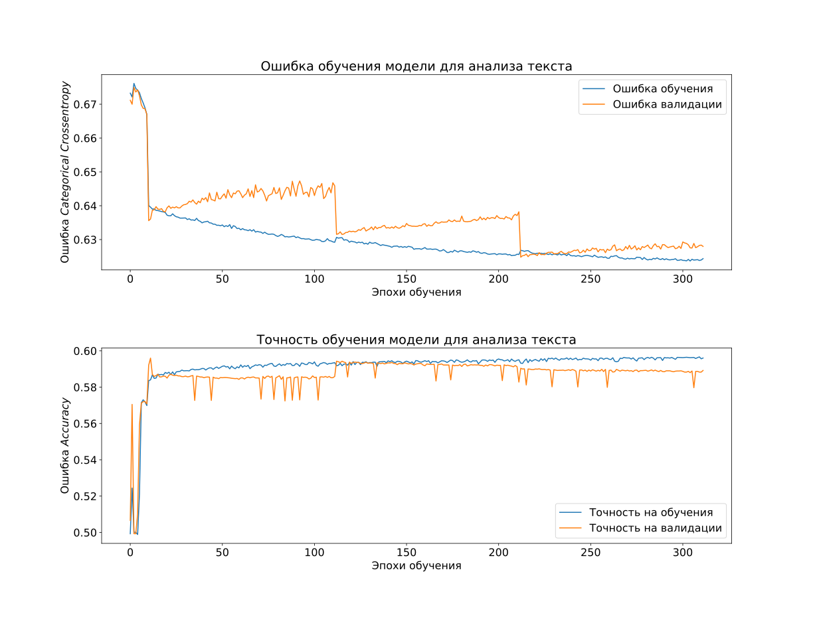

# “Цифровой Прорыв” 2020 Финал

## Команда Deaf Lizards

## Кейс Газпромбанк

-----
[ChoiceApp](https://choiceapp.deaflizards.ru) — сервис, который поможет кандидату и рекрутеру найти друг друга!

Requirenments
Docker, Docker-Compose

Installation

```sh
git clone it@github.com:melchugin/choiceapp.deaflizards.ru.git
cd choiceapp.deaflizards.ru
docker-compose build --compress --force-rm --parallel --pull
docker-compose up
```

## Containers info


## Research / Исследование

### Модель для определения эмоциональной окраски текста

Зависимости:
* `tensorflow >= 2` 
* `keras`
* `nltk`
* `navec`

Модель обучалась на базе русскоязычных твиттов. Датасет: https://study.mokoron.com/. В основе лежит LSTM-сеть и несколько полносвязных слоев слоёв. Модель сохранена в формате keras в файле `research/sentiment_predictor`. Обучалась на GPU, в файле `research/train_history.pickle` находятся веса, в виде `dict`, ключи:
* `loss` - ошибка на обучающих данных (Categorical Crossentropy)
* `val_loss` - ошибка на валидационных данных (Categorical Crossentropy)
* `acc` - точность на обучении
* `val_acc` - точность на валидационных данных

Валидация составляла 10% от обучающей выбокри, валидационные данные выбирались случайно каждые 100 эпох.

Для самостоятельного обучения можно использовать как jupyter-тетрадку, так и `research/trainer.py`, однако, необходимо получить эмбединги для слов (ввиду ограниченности объема github файлы `.npy` не загружали), для этого выполнить:

```python
from nltk.tokenize import word_tokenize
from navec import Navec
import re

import numpy as np
import pandas as pd

path = <путь до файла navec_hudlit_v1_12B_500K_300d_100q.tar (в папке research)> 
navec = Navec.load(path)

positive = pd.read_csv("research/train_data/positive.csv", delimiter=";", index_col=False)
negative = pd.read_csv("research/train_data/negative.csv", delimiter=";", index_col=False)
positive['ttext'] = positive['ttext'].apply(lambda x: x.lower())
positive['ttext'] = positive['ttext'].apply((lambda x: re.sub('[^a-zA-z0-9\s]','',x)))
negative['ttext'] = negative['ttext'].apply(lambda x: x.lower())
negative['ttext'] = negative['ttext'].apply((lambda x: re.sub('[^a-zA-z0-9\s]','',x)))

X = np.hstack([positive["ttext"].values[:50000] , negative["ttext"].values[:50000]])
y = (np.hstack([positive["ttype"].values[:50000] , negative["ttype"].values[:50000]]) + 1) / 2
y = np.eye(2)[y.reshape(-1).astype(np.int8)]

def vectorizator(X:np.array):
    tokens = []
    max_lenth = 0
    for i in X:
        tokens.append(word_tokenize(''.join( c for c in re.sub(r'', '', i) if  c not in '.,!()-:?' )))
        if len(tokens[-1]) > max_lenth:
            max_lenth = len(tokens[-1])
    
    print(f"Максимальная длинна сообщения: {max_lenth}")
    
    for i in range(len(tokens)):
        tokens[i].extend([0 for x in range(max_lenth - len(tokens[i]))])
    
    vec = np.ndarray(shape=(len(X), max_lenth, 300))
    
    for phrase in range(len(tokens)):
        for word in range(len(tokens[phrase])):
            if tokens[phrase][word] == 0:
                vec[phrase, word] = np.zeros(shape = (1, 300))
            else:
                try :
                    vec[phrase, word] = navec[tokens[phrase][word].lower()]
                except KeyError:
                    vec[phrase, word] = np.zeros(shape = (1, 300))
    
    return vec

X = vectorizator(X)
```

Модель обучалась около 2 часов. Результаты обучения:

