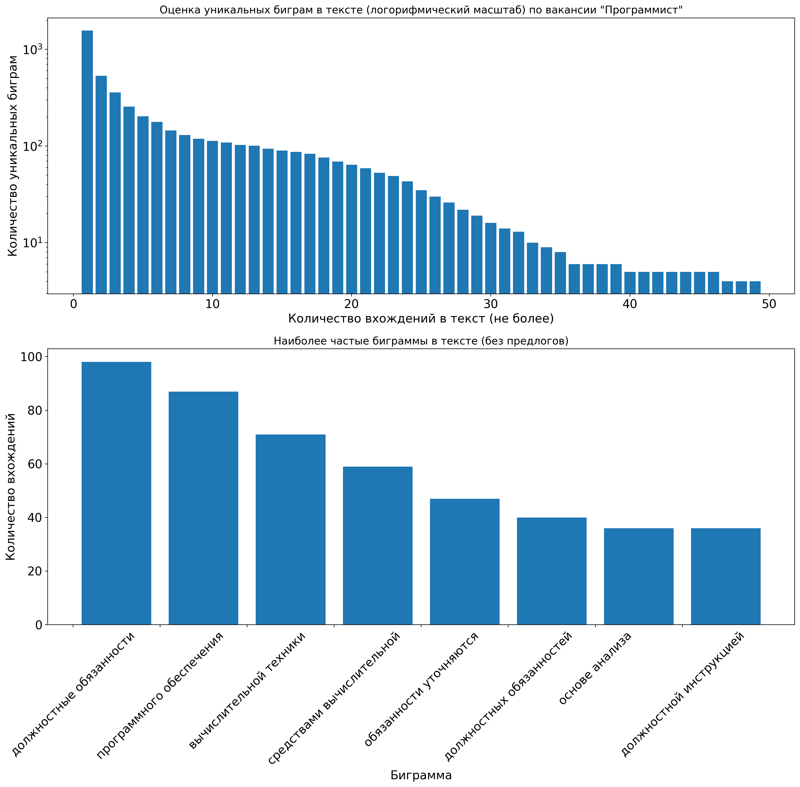

# “Цифровой Прорыв” 2020 Финал

## Команда Deaf Lizards

## Кейс Газпромбанк

[![github workflow stage build img]][github workflow stage build]
[![github workflow prod deploy img]][github workflow prod deploy]

[github workflow stage build img]: https://github.com/melchugin/choiceapp.deaflizards.ru/workflows/Docker%20image%20stage%20CI/badge.svg?branch=stage
[github workflow stage build]: https://github.com/melchugin/choiceapp.deaflizards.ru/actions?query=workflow%3A%22Docker+image+stage+CI%22

[github workflow prod deploy img]: https://github.com/melchugin/choiceapp.deaflizards.ru/workflows/Production%20deploy/badge.svg?branch=master
[github workflow prod deploy]: https://github.com/melchugin/choiceapp.deaflizards.ru/actions?query=workflow%3A%22Production+deploy%22

[ChoiceApp](https://choiceapp.deaflizards.ru) — сервис, который поможет кандидату и рекрутеру найти друг друга!

Requirenments
Docker, Docker-Compose

Installation

```sh
git clone it@github.com:melchugin/choiceapp.deaflizards.ru.git
cd choiceapp.deaflizards.ru
docker-compose build --compress --force-rm --parallel --pull
docker-compose up
```

## Containers info


## Research / Исследование

### Модель для определения эмоциональной окраски текста

Зависимости:
* `tensorflow >= 2` 
* `keras`
* `nltk`
* `navec`

Модель обучалась на базе русскоязычных твиттов. Датасет: https://study.mokoron.com/. В основе лежит LSTM-сеть и несколько полносвязных слоёв. Модель сохранена в формате `keras`\`а в файле `research/sentiment_predictor`. Обучалась на GPU, в файле `research/train_history.pickle` находится история обучения, в виде `dict`, ключи:
* `loss` - ошибка на обучающих данных (Categorical Crossentropy)
* `val_loss` - ошибка на валидационных данных (Categorical Crossentropy)
* `acc` - точность на обучении
* `val_acc` - точность на валидационных данных

Валидация составляла 10% от обучающей выбокри, валидационные данные выбирались случайно каждые 100 эпох.

Для самостоятельного обучения можно использовать как jupyter-тетрадку, так и `research/trainer.py`, однако, необходимо получить эмбединги для слов (ввиду ограниченности объема github файлы `.npy` не загружали), для этого выполнить:

```python
from nltk.tokenize import word_tokenize
from navec import Navec
import re

import numpy as np
import pandas as pd

path = <путь до файла navec_hudlit_v1_12B_500K_300d_100q.tar (в папке research)> 
navec = Navec.load(path)

positive = pd.read_csv("research/train_data/positive.csv", delimiter=";", index_col=False)
negative = pd.read_csv("research/train_data/negative.csv", delimiter=";", index_col=False)
positive['ttext'] = positive['ttext'].apply(lambda x: x.lower())
positive['ttext'] = positive['ttext'].apply((lambda x: re.sub('[^a-zA-z0-9\s]','',x)))
negative['ttext'] = negative['ttext'].apply(lambda x: x.lower())
negative['ttext'] = negative['ttext'].apply((lambda x: re.sub('[^a-zA-z0-9\s]','',x)))

X = np.hstack([positive["ttext"].values , negative["ttext"].values)
y = (np.hstack([positive["ttype"].values , negative["ttype"].values) + 1) / 2
y = np.eye(2)[y.reshape(-1).astype(np.int8)]

def vectorizator(X:np.array, max_lenth=None):
    tokens = []
    if max_lenth == None:
        max_lenth = 0
        flag_to_compute = True
    else:
        flag_to_compute = False
        
    for i in X:
        tokens.append(word_tokenize(''.join( c for c in re.sub(r'', '', i) if  c not in '.,!()-:?' )))
        if flag_to_compute == True and len(tokens[-1]) > max_lenth:
            max_lenth = len(tokens[-1])
    
    print(f"Максимальная длинна сообщения: {max_lenth}")
    
    for i in range(len(tokens)):
        tokens[i].extend([0 for x in range(max_lenth - len(tokens[i]))])
    
    vec = np.ndarray(shape=(len(X), max_lenth, 300))
    
    for phrase in range(len(tokens)):
        for word in range(len(tokens[phrase])):
            if tokens[phrase][word] == 0:
                vec[phrase, word] = np.zeros(shape = (1, 300))
            else:
                try :
                    vec[phrase, word] = navec[tokens[phrase][word].lower()]
                except KeyError:
                    vec[phrase, word] = np.zeros(shape = (1, 300))
    
    return vec

X = vectorizator(X)
```

Модель обучалась около 2 часов. Результаты обучения:


Применение модели (при обучении длинна входной последовательности `max_lenth` = 18):

```python
from keras.models import load_model
sentiment_predictor = load_model("research/sentiment_predictor")

text = [
    u"Самая тупая работа, лучше б и не приходил, ненависть!",
    u"Обожаю вашу компанию, хочу работать только у вас!"
]
new_entry = vectorizator(text, 18)

predict = sentiment_predictor.predict_classes(new_entry)

prediction_encode = {0: "Негативная окраска", 1: "Позитивная окраска"}
print(f"{text[0]} -- {prediction_encode[predict[0]]}\n{text[1]} -- {prediction_encode[1]}")
```

Для понимания работы модели необходимо выделять входные слова, наиболее повлиявшие на оценку. Ввиду обучения модели на твитах достаточно низкая точность на текстах резюме. Проблема решается дообучением на текстах из предметной области. Подсвечивание слов по которым определяется настроение текста, производится по следующей логике: берется оценка всего текста, затем каждое слово "выкидывается", результат сортируется по возрастанию вероятности классификации. Таким образом можно оценить влияние каждого конкретного слова на результат. Пример применения:

```python

text = "Хотелось бы работать в развивающейся компании"

def predictor_mark_words(model, text: str):
    vec = vectorizator([text], 18)   
    for w in text.split(" "):
        temp_text = ''.join([str(c) + " " for c in text.split(" ") if  c != w])
        vec = np.vstack([vec, vectorizator([temp_text], 18, verbose=False)])
    predict = sentiment_predictor.predict_proba(vec)
    res = np.argmax(a[0])
    marks = predict[1:, res].argsort()[-3:]
    return np.asarray(text.split(" "))[marks]

result = predictor_mark_words(sentiment_predictor, text)
print(result, prediction_encode[sentiment_predictor.predict_classes(vectorizator([text], 18))[0]])
```

Результат работы функции:

`['развивающейся' 'компании' 'работать'] Позитивная окраска`

### Статистический анализ текста вакансий
Вакансии получены из открытых источников. На данный момент обработано чуть более **850** вакансий. Проводился анализ по частоте вхождения слов, биграмм для каждой категории вакансий:
* программист 
* дизайнер компьютерной
* системный администратор
* тестировщик
* разработчик

Ниже приведены результаты анализа для вакансии *программист*:




Собрана статистика по словам/биграммам (по обозначенным группам вакансий) - находятся в файлах `research/train_data/words_statistic.csv` и `research/train_data/bigrams_statistic.csv`. Реализована функция выделения наиболее часто встречающихся слов/биграмм в тексте вакансии, а так же наиболее редких (уникальных). Предполагается дообучения по мере получения новой информации о вакансиях - определяется параметром `freq`. Пример выполнения функции:

```python
test_vac = "Определяет информацию, подлежащую обработке средствами вычислительной техники, ее объемы, структуру, макеты и схемы ввода, обработки, хранения и вывода, методы ее контроля. Выполняет работу по подготовке программ к отладке и проводит отладку."

result = mark_text_vacancies(test_vac, vac_type="программист", freq=True)
print(result)
```
Вывод:
`(['обработка', 'отладка'], ['вычислительной техники', 'средствами вычислительной'])`